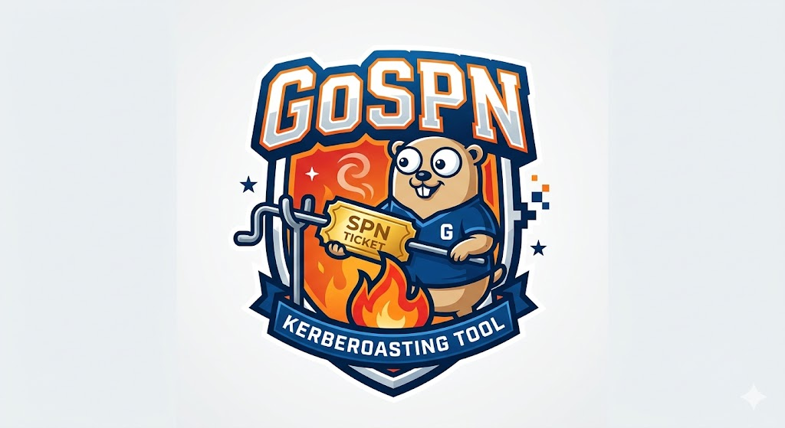

# GoSPN

<p align="center">
  
</p>

**GoSPN** is a focused, Windows-only Kerberoasting tool written in Go. Using the
current logon session (Windows SSPI, no credentials required) it locates
roastable accounts in the directory and requests service tickets, emitting
crackable `$krb5tgs$` hashes in hashcat format.

For authorized security testing, CTFs, and lab use only.

## Features

- **Two enumeration methods** (`-method`, required):
  - `ldap` — query the DC over LDAP/LDAPS (389/636) via GSSAPI bind.
  - `adws` — query the DC over **Active Directory Web Services** (TCP 9389), a
    native Go port of the NMF / NegotiateStream / NBFSE stack (à la SoaPy),
    authenticated with SSPI Negotiate. Stealthier than LDAP.
- **Target a single user** with `-user <sAMAccountName>`, or roast everyone.
- **Single explicit SPN** with `-spn` (no directory enumeration).
- **`-tgtdeleg`** — the Kekeo "TGT delegation" trick: extract a forwarded TGT
  for the current user and use it to request **RC4 (etype 23)** service tickets,
  yielding crackable hashes even for AES-only accounts.
- **`-rc4opsec`** — OPSEC targeting: skip accounts that **advertise AES**
  (`msDS-SupportedEncryptionTypes` with an AES bit), so requesting an RC4 ticket
  raises **no RC4-downgrade signal** (the #1 Kerberoasting detection, Event 4769
  enc-type `0x17` on an AES-capable account). Accounts with the attribute unset
  are still targeted. Mirrors Rubeus `/rc4opsec`.
- **Rubeus-style flags** — accepts `/flag` and `/flag:value` in addition to
  `-flag`; unrecognized arguments are reported, not silently dropped.
- `-stats`, `-outfile`, `-ldaps`, `-ldapfilter`, `-domain`, `-dc`, `-nobanner`.

## Usage

```
gospn -method ldap                       Roast every roastable user (LDAP)
gospn -method adws                       Roast every roastable user (ADWS)
gospn -method ldap -user svc_sql         Roast only the svc_sql account
gospn -spn MSSQLSvc/db:1433              Roast one explicit SPN (no enumeration)
gospn -method ldap -tgtdeleg             Roast everyone, forcing RC4 via tgtdeleg
gospn -method adws -rc4opsec             Roast only RC4-native accounts (no downgrade signal)
gospn -method adws -outfile out.txt      Write hashes to a file
gospn -method ldap -stats                List roastable accounts only
```

## Build

```
go build -o gospn.exe .
```

Windows / amd64 only (uses SSPI and the LSA).

## Implementation notes & validation status

| Area | Status |
| --- | --- |
| LDAP enumeration (auto-LDAPS + RFC 5929 channel binding for EPA-enforced DCs) | verified against a live DC |
| Single explicit SPN roast | working |
| SSPI ticket request + `$krb5tgs$` hash format | verified against a live DC |
| NBFX/NBFSE binary-XML codec | unit-tested round-trip (`go test`) |
| ADWS transport (NMF + NegotiateStream + sealing + WS-Enumeration) | verified against a live DC |
| `tgtdeleg` (SSPI delegation + LSA session key + RC4 TGS over the wire) | verified against a live DC |
| `-rc4opsec` (msDS-SupportedEncryptionTypes bitwise targeting filter) | working |

The core paths have been exercised end-to-end against a hardened DC (LDAP signing
and channel binding enforced). The NBFX dictionary is generated from the MC-NBFX
static string table.
